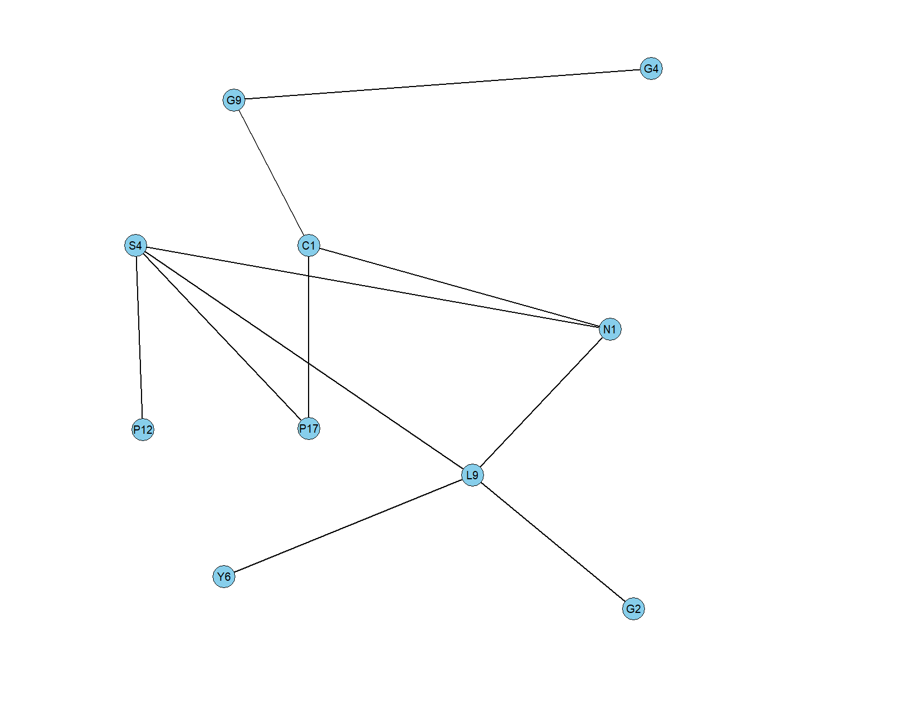

# Bidirectional Graph Generator

This project provides a software/GUI tool to easily create and generate bidirectional graphs. It allows users to visually design graphs, define nodes and edges, and export the graph data in JSON and C++ formats.

## Features

- **Graph Creation**: Intuitive GUI for creating nodes and edges.
- **Node Types**: Supports different types of nodes (e.g., collection points, delivery points, pathfinding points).
- **Edge Management**: Easily add or remove edges between nodes.
- **Export Functionality**: Generates adjacency lists in JSON format and C++ code for integration with other systems.
- **Customizable Coordinates**: Allows users to specify coordinates for each node.

## Usage Instructions

1. **Run the Application**:
   - Execute `graph_creator.py` to launch the GUI.
   - Use the left mouse button to create nodes, right mouse button to create edges, and middle mouse button to delete items.

2. **Define Nodes**:
   - Click on the canvas to create a node.
   - Enter a unique name for the node when prompted.

3. **Connect Nodes**:
   - Right-click and drag from one node to another to create an edge.

4. **Export Graph**:
   - Press the `A` key to save the graph as a JSON adjacency list in `resources/graph_adjacency_list.json`.
   - The graph data will also be used to generate a C++ file (`resources/generated_map.cpp`) using `gen.py`.

5. **Run the Generator**:
   - Execute `gen.py` to generate the C++ adjacency list file.

### Example

```markdown

```

## File Structure

```
project---bidirectional-graph-generator/
├── include/
│   └── data_structure.hpp  # Defines the waypoint class for C++ integration
├── resources/
│   ├── graph_adjacency_list.json  # Stores the adjacency list in JSON format
│   ├── coordinates.json  # Stores node coordinates
│   └── generated_map.cpp  # Generated C++ file with adjacency list
├── src/
│   ├── gen.py  # Script to generate C++ adjacency list
│   └── graph_creator.py  # GUI application for graph creation
├── .gitignore  # Git ignore file
└── README.md  # Project documentation
```

## Requirements

- Python 3.x
- Tkinter (for GUI)
- JSON module (built-in)

## How to Contribute

1. Fork the repository.
2. Create a new branch for your feature or bug fix.
3. Commit your changes and submit a pull request.

## License

This project is licensed under the MIT License.
